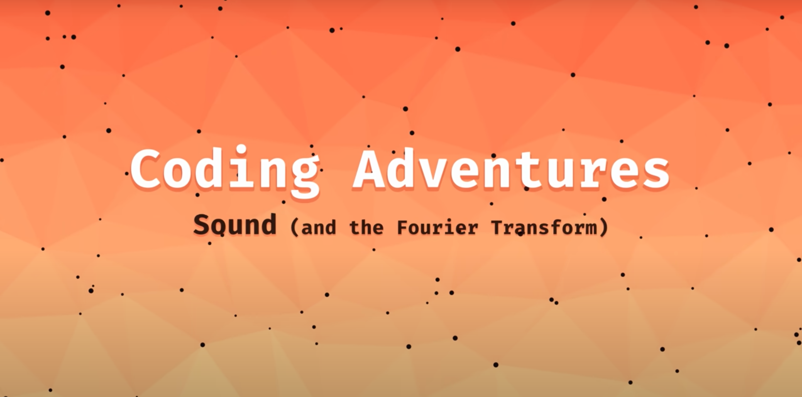
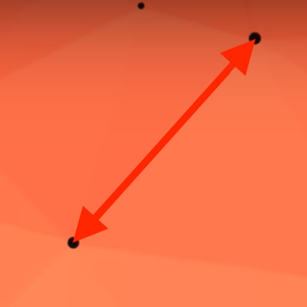
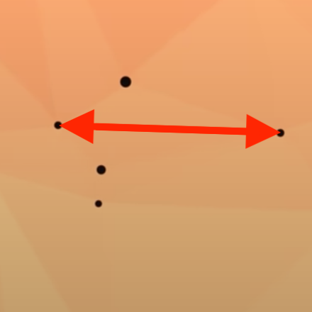
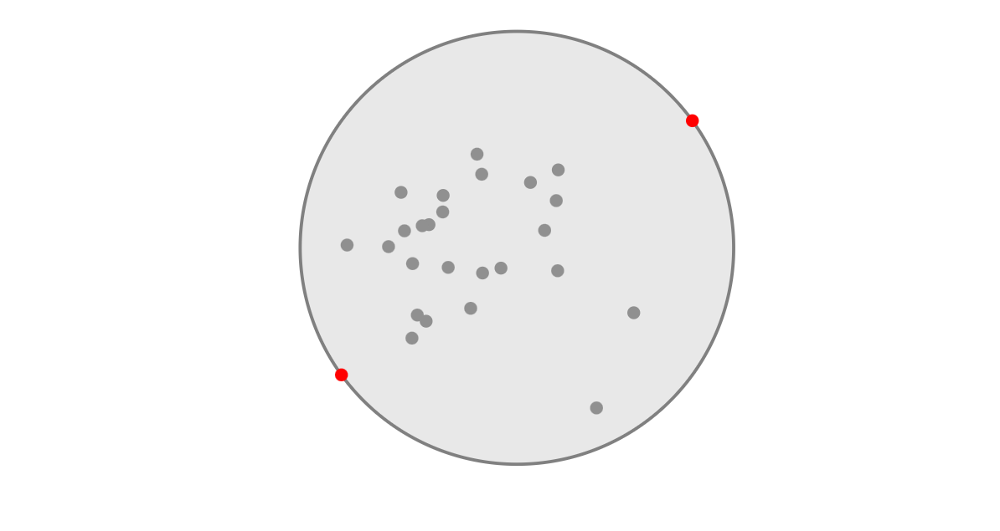
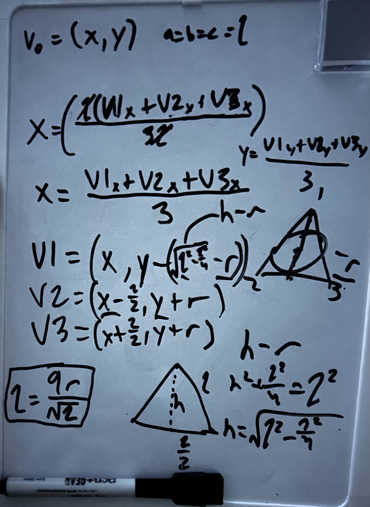
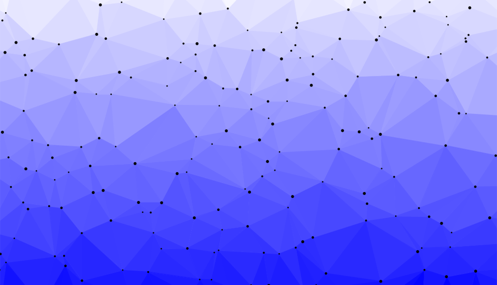
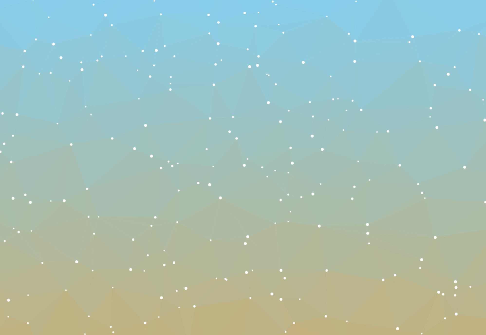
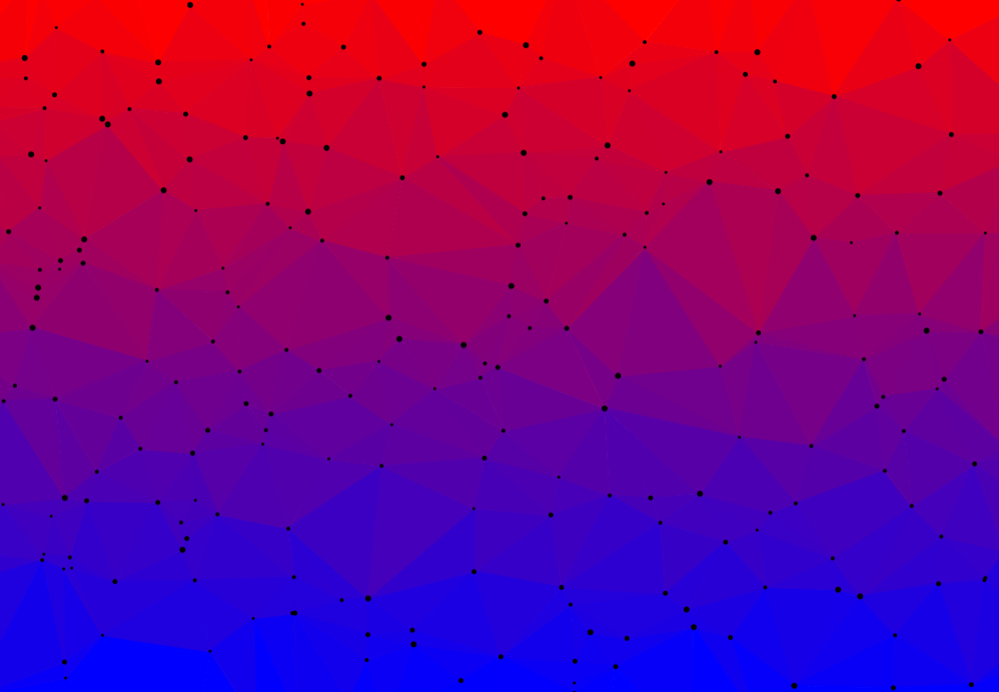

## Foreword
Before you read any further, go watch one (or more) of [Sebastian Lague](https://youtube.com/@sebastianlague?si=RK50msgDvIPLlKW1)'s videos! He is the primary inspiration for this project and an amazing watch.

# Triangle Mesh
The main reason I watch Sebastian Lague is to see just how creative coding can get. While he mostly uses Unity, everything happening behind the scenes is written in code. 

Processing is the best IDE I know for making visual code. It was basically built for 2D and 3D rendering! So, as I started noticing the intros to Sebastian's videos more and more, I saw that they were actually quite complex. My intial thought was that is was just a bunch of dots floating around in a gradient, but that changed when I realized they had lines forming between them.

Struck with inspiration, I headed to Processing and wrote a class for a dot that has a position, velocity, and a method to check if another dot was in a certain range. My plan was to create lines between dots that were nearby and create shapes with those lines. 

When I went back to Sebastian's video to find out how long to make the checking range, however, I realized just how inconsistent this distance seemed to be. Some dots that were very far away from each other had lines between them,

while others at a closer range did not.

Clearly my logic was flawed. 

## The Math
My immediate thought was something I had seen in one of his videos, that being a web of triangles joined together. While the dots I had flying around my screen certainly looked like they belonged together, I didn't know the math to prove it. My search led me to the [Bowyer-Watson algorithm for Delauney triangulation](https://www.gorillasun.de/blog/bowyer-watson-algorithm-for-delaunay-triangulation/#vertex,-edge-and-triangle-class) (which is just a fancy way to say "making dots form triangles with math"). 

During my intial skim of the article I came across terms such as "supertriangle" and "circumcircle," both of which I could understand but not compute. This is where my background in math came in handy! 

To start out, I found [this](https://www.nayuki.io/page/smallest-enclosing-circle?ref=gorillasun.de) website, which describes in [this](https://www.nayuki.io/res/smallest-enclosing-circle/SmallestEnclosingCircle.java) code snippet how to find the smallest circle that contains all dots in a set. This is an important first step as described by the Bowyer-Watson article in finding the supertriangle.

So, now I have a circle that is guaranteed to have all the dots on the screen within or on it. The next step is to construct a triangle around it, which is also guaranteed to contain all the dots. This circle-triangle relationship described the circle as an "incircle." I found [this](https://artofproblemsolving.com/wiki/index.php/Incircle?srsltid=AfmBOopvAoh988Yag0av-B9De17eNEGD55rDI8sJ9OYFSTOQZ-4VFr6K) article explaining the math behind calculating an incircle. Since I already had the incircle and needed to find its triangle, I had to do the math in reverse:

To do this, I assumed the triangle I wanted to make was equilateral and its base was parallel with the x-axis. 

The last bit of math I had to do came from [this](https://en.wikipedia.org/wiki/Circumcircle#:~:text=coordinates%5Bedit%5D-,Cartesian%20coordinates,-%5Bedit%5D) Wikipedia article on calculating a circumcircle for a triangle. Every single triangle on the screen needs a circumcircle to calculate if other triangles should be made. You can find the equations here exactly duplicated in [this](Circumcircle.pde) class in my project.

## Trusting the Process
With all the math in place, all that was left to do was to [code it all in place](https://www.gorillasun.de/blog/bowyer-watson-algorithm-for-delaunay-triangulation/#vertex,-edge-and-triangle-class:~:text=minimum%20enclosing%20circle.-,Triangulation%20Procedure,-Here%27s%20an%20example). This part of the journey was magical. I had done all the math and implemented all the necessary classes to prepare me to just put the pieces together. 

I will admit, I did "trust the process" a bit too much here. I understood the code I was writing enough to fix the author's mistakes, but I still do not understand how a bunch of triangles are made from a list of points. That's a venture for another time.

## The end result

From the very beginning, my triangles have had different colors based on their y-position. Now, though, with the entire thing working properly, the effect is truly beautiful. 

## Afterword
Feel free to play around with this code as much as you want. It is certainly not perfect, but I will make improvements as I go. The color presets are very fun to customize! Try "AMMON" and "SAND" for the top and top bottom, respectively. BLUE and RED also blend very well together. Also try combining color schemes with accents of black, white, or transparent dots. 

### Gallery

### Resources
https://youtube.com/@sebastianlague?si=RK50msgDvIPLlKW1 
https://www.gorillasun.de/blog/bowyer-watson-algorithm-for-delaunay-triangulation/ 
https://en.wikipedia.org/wiki/Circumcircle 
https://www.nayuki.io/res/smallest-enclosing-circle/SmallestEnclosingCircle.java 
https://artofproblemsolving.com/wiki/index.php/Incircle?srsltid=AfmBOopvAoh988Yag0av-B9De17eNEGD55rDI8sJ9OYFSTOQZ-4VFr6K
